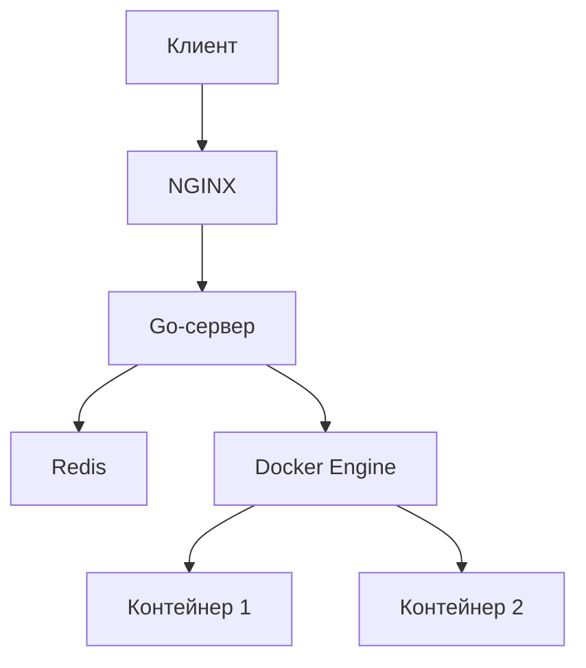

### 1. Архитектура
**Клиент-серверная модель**:
- **Фронтенд**: Веб-интерфейс с редактором кода (HTML/CSS/JS)
- **Бэкенд**: Go-сервер для обработки запросов
- **Сервис выполнения кода**: Изолированное окружение (Docker)

---

### 2. Технологический стек
| Компонент       | Технологии                          |
|-----------------|-------------------------------------|
| **Фронтенд**    | React/Vue.js + CodeMirror/Monaco Editor |
| **Бэкенд**      | Go (Gin/Echo)                       |
| **Выполнение кода** | Docker API + Go-образ (`golang:latest`) |
| **Хранение**    | Redis (кеш), PostgreSQL (сохранённые проекты) |
| **Инфраструктура** | Docker, Kubernetes (масштабирование) |

---

### 3. Ключевые компоненты

#### A. Фронтенд
- **Редактор кода**: 
  - [Monaco Editor](https://microsoft.github.io/monaco-editor/) (движок VS Code) 
  - Подсветка синтаксиса, автодополнение, мультикурсор
- **Интерфейс**:
  - Кнопка "Run"
  - Панель вывода (stdout/stderr)
  - Возможность сохранения сниппетов

#### B. Бэкенд (Go)
**Маршруты**:
```go
// Обработчики
router.POST("/api/run", RunCodeHandler)   // Выполнение кода
router.POST("/api/save", SaveCodeHandler) // Сохранение кода
```

**Пример обработчика выполнения кода**:
```go
func RunCodeHandler(c *gin.Context) {
    var req struct {
        Code string `json:"code"`
    }
    if err := c.BindJSON(&req); err != nil {
        c.JSON(400, gin.H{"error": "Invalid request"})
        return
    }

    // Запуск в Docker
    output, err := RunInDocker(req.Code)
    if err != nil {
        c.JSON(500, gin.H{"error": err.Error()})
        return
    }

    c.JSON(200, gin.H{"output": output})
}
```

#### C. Сервис выполнения кода
**Запуск кода в Docker**:
```go
import (
    "github.com/docker/docker/api/types"
    "github.com/docker/docker/client"
)

func RunInDocker(code string) (string, error) {
    ctx := context.Background()
    cli, err := client.NewClientWithOpts(client.FromEnv)
    
    // Создаём временный файл с кодом
    tmpFile, _ := os.CreateTemp("", "go_*.go")
    tmpFile.WriteString(code)
    defer os.Remove(tmpFile.Name())

    // Конфигурация контейнера
    resp, err := cli.ContainerCreate(ctx, &container.Config{
        Image: "golang:latest",
        Cmd:   []string{"go", "run", "/app/main.go"},
    }, &container.HostConfig{
        Binds: []string{tmpFile.Name() + ":/app/main.go"},
        Resources: container.Resources{
            Memory: 100 * 1024 * 1024, // 100MB RAM
            CPUQuota: 50000, // 50% CPU
        },
    }, nil, nil, "")
    
    // Запуск контейнера с таймаутом
    err = cli.ContainerStart(ctx, resp.ID, types.ContainerStartOptions{})
    timeoutCtx, _ := context.WithTimeout(ctx, 5*time.Second)
    statusCh, errCh := cli.ContainerWait(timeoutCtx, resp.ID, container.WaitConditionNotRunning)

    select {
    case err := <-errCh:
        // Обработка ошибки
    case <-statusCh:
        // Чтение логов
        out, _ := cli.ContainerLogs(ctx, resp.ID, types.ContainerLogsOptions{ShowStdout: true})
        buf := new(strings.Builder)
        buf.ReadFrom(out)
        return buf.String(), nil
    }
}
```

---

### 4. Безопасность
1. **Изоляция**:
   - Запуск каждого запроса в отдельном Docker-контейнере
   - Ограничение ресурсов (CPU/RAM)
   - Без сети (`NetworkMode: "none"`)

2. **Защита от вредоносного кода**:
   - Фильтрация системных вызовов (seccomp-bpf)
   - Read-only файловая система
   - Запрет на запуск бинарных файлов

3. **Ограничения**:
   - Таймаут выполнения (5-10 секунд)
   - Ограничение частоты запросов (rate limiting)

---

### 5. Оптимизация
- **Пул контейнеров**: Предварительно созданные контейнеры с Go
- **Кеширование**: Результатов выполнения для одинакового кода (Redis)
- **Асинхронная обработка**: Очередь задач (RabbitMQ/NATS)
- **WebSocket**: Для реального времени вывода логов

---

### 6. Развёртывание


---

### 7. Расширение функциональности
1. **Мультиязычность**: Поддержка Python, JavaScript через разные Docker-образы
2. **Отладка**: Интеграция с Delve (Go debugger)
3. **Песочница**: 
   - Готовые примеры кода
   - Unit-тестирование пользовательского кода
4. **Git-интеграция**: Импорт/экспорт репозиториев

---

### 8. Полезные библиотеки Go
- [Docker SDK](https://pkg.go.dev/github.com/docker/docker/client) - Управление контейнерами
- [Gin](https://gin-gonic.com/) - Веб-фреймворк
- [Go-RateLimiter](https://github.com/uber-go/ratelimit) - Ограничение запросов
- [Monaco Editor React](https://github.com/suren-atoyan/monaco-react) - Интеграция редактора

---

### Пример.env конфигурации
```env
DOCKER_API_VERSION=1.41
MAX_CONTAINERS=10
TIMEOUT=5s
REDIS_URL=redis://localhost:6379
```

Такой подход обеспечит безопасное выполнение кода с изоляцией через Docker, горизонтальную масштабируемость и профессиональный интерфейс редактора.
